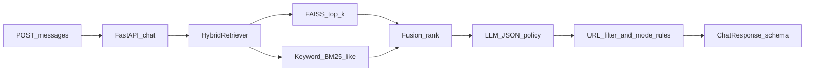

# Approach: SHL Conversational Assessment Recommender

## Problem and goals

Recruiters need concise, trustworthy guidance to pick SHL Individual Test Solutions from a large catalog. The service must stay **stateless**, refuse unsafe or off-scope requests, **never invent URLs**, and return a **strict JSON schema** suitable for downstream systems.

## Architecture

The API is a thin FastAPI layer over three components:

1. **Hybrid retriever** — loads `catalog.json` and a FAISS `IndexFlatIP` built on L2-normalized `sentence-transformers` embeddings (cosine similarity via inner product). Candidate URLs are always real catalog rows.
2. **LLM policy layer** — Groq or OpenRouter chat completion with `response_format: json_object`. The model receives the recent conversation plus a **closed-world** `CANDIDATES_JSON` list (top hybrid hits). It must choose `recommended_urls` from that list only.
3. **Post-processor** — filters model-proposed URLs against the allowlist, clears recommendations for `clarify` / `refuse`, applies a small **vagueness heuristic** on early turns to keep `recommendations` empty until the user gives role-relevant detail, and falls back to deterministic top retrieval hits if the LLM is unavailable.

## Retrieval pipeline

- **Corpus text:** `name`, `test_type`, and `description` (built at scrape time from SHL table columns and type legend).
- **Semantic leg:** encode the latest conversation slice as one string; retrieve `k` neighbors (default prefetch 60, return top 10 after fusion).
- **Keyword leg:** token-level BM25-like scoring with document frequency over the in-memory catalog (no extra search engine dependency).
- **Fusion:** `combined = w_sem * norm_semantic + w_kw * norm_keyword` with weights favoring semantics (`0.82` / `0.18`) while still boosting exact product/skill tokens—helpful for **Recall@10** when dense embeddings under-rank rare strings.

**Evaluation (offline):** curate ~50–100 recruiter-style queries, manually label relevant `url` sets from the catalog, and measure Recall@k for `k ∈ {5,10}` comparing pure-FAISS vs hybrid. Tune `w_kw` and prefetch `k` on a held-out query set.

## Prompt strategy

- Single system contract: closed-world over `CANDIDATES_JSON`, explicit refusal and injection handling, concise replies, JSON-only output keys (`mode`, `reply`, `recommended_urls`, `end_of_conversation`).
- One automatic **JSON repair** retry if parsing fails (common with smaller models).
- **Grounding guarantee:** even if the model hallucinates a URL, the post-filter drops unknowns; if the model returns `recommend` but no valid URLs and the query is not vague, the API fills from top fused retrieval results so the user still receives valid SHL links.

## Tradeoffs

| Choice | Upside | Downside |
|--------|--------|----------|
| `all-MiniLM-L6-v2` embeddings | Fast CPU inference, small index | Lower semantic fidelity than larger models |
| `IndexFlatIP` | Simple, exact top-k | O(n) per query; acceptable for ~400–500 vectors |
| No LangChain | Fewer moving parts, easier to interview-defend | More manual prompt/string handling |
| Pagination scraper | Complete catalog without headless browser | Breaks if SHL HTML layout changes—parser is isolated in `scraper/scrape_shl.py` |

## Improvements attempted

- Hybrid keyword fusion to lift skill/product-token matches into the top 10.
- Table-header-based HTML anchoring for robustness against marketing copy changes.
- Politeness delays + pagination to mirror real browsing while staying respectful to SHL infrastructure.

## Why this stack

- **FastAPI + Pydantic** — schema-first API matching the assignment JSON contract.
- **FAISS + local embeddings** — predictable latency/cost on CPU hosts (Render free tier friendly) without paying per embedding API call at runtime.
- **Groq/OpenRouter** — free/low-cost chat models for policy and phrasing while retrieval does the heavy factual lifting.
